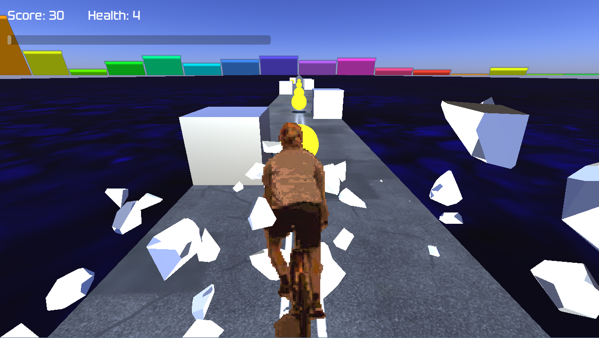
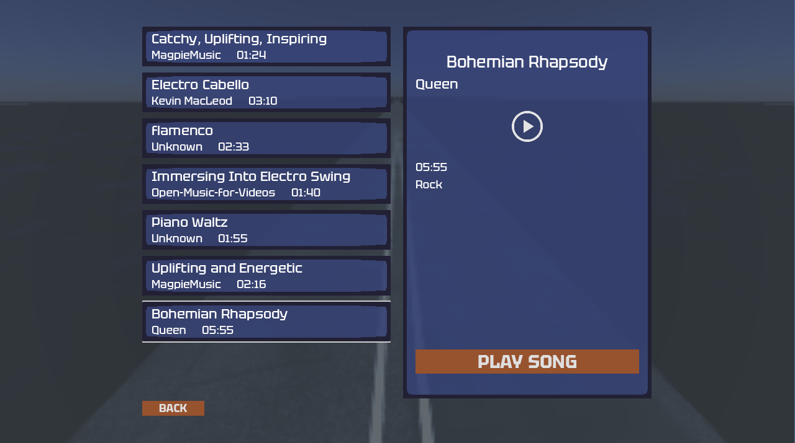
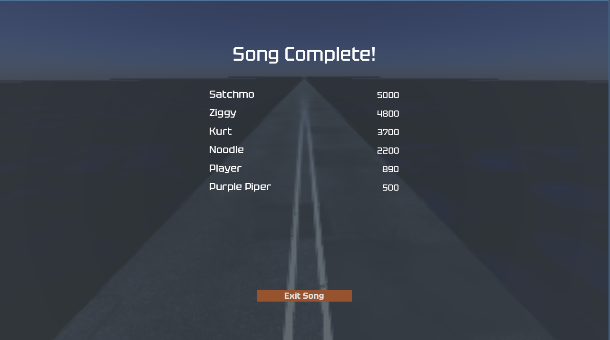

# 🎵 Wave Rider 🎵


## 🚀 Introduction

Wave Rider is a music-driven rhythm game where players navigate a biker through a procedurally generated world that responds to the beat and dynamics of music. Collect coins and avoid obstacles that spawn in perfect sync with the music's beat and rhythm. The game features customizable music support, allowing players to import and play their own songs!

## 👨‍💻 Developers

- [Daniela Gallegos Dupuis](https://github.com/danigallegdup)
- [Noah E.D. Jacobsen](https://github.com/NoahJacobsen)
- [Erfan Golpour](https://github.com/erfangolpour)
- [Weiting Ye](https://github.com/Tony031201)

## ✨ Features

- **Music-synchronized Gameplay**: Obstacles and coins appear in sync with the beats and onsets detected in music
- **Interactive Visualizations**: Real-time audio visualizations that respond to the music playing
- **Dynamic Environments**: Game environment colors and effects adapt to the genre and mood of the music
- **Custom Music Support**: Import your own audio files (MP3, WAV, M4A) and play the game with your favorite songs
- **Leaderboard**: Compete with prerecorded high scores and see how you stack up against other players
- **Cross-Platform Support**: Play in your browser or download for Windows
- **Time-scale Effects**: Experience dramatic slow-motion effects during critical gameplay moments

## 🎮 Screenshots


_Navigate through obstacles and collect coins while riding to the beat_


_Select from available songs or add your own_


_Try again to beat your high score_

## 📥 Installation

### Web Version

The latest version of Wave Rider can be played directly in your browser by visiting [our GitHub Releases page](https://github.com/danigallegdup/WaveRider/releases) or on [itch.io](https://danigallegdup.itch.io/waverider).

> **Note:** If downloading the web version from GitHub Releases, you'll need to run a local server to play it properly. You can use Python's built-in HTTP server:
>
> ```
> # Python 3
> python -m http.server
>
> # Python 2
> python -m SimpleHTTPServer
> ```
>
> Then open your browser and navigate to `http://localhost:8000`

The itch.io version can be played directly without any additional setup.

### Windows Executable

1. Download the latest `.exe` release from our [GitHub Releases page](https://github.com/danigallegdup/WaveRider)
2. Run the executable - no installation required!

## 🎵 Adding Custom Songs

Wave Rider allows you to add your own songs to the game! Here's how:

### Prerequisites

- Python 3.6+ installed
- Required Python packages: librosa, numpy
- Your favorite music files (MP3, WAV, M4A, and any other format supported by librosa)

### Installation Steps for Custom Music Analysis

1. Install required Python packages:

   ```
   pip install librosa numpy
   ```

2. Run the extraction script located in `MIR\scripts` with your music file:

   ```
   python extract_song_data.py --file-name "path\to\your\song.mp3" --name "Song Title" --genre "Rock" --artist "Artist Name"
   ```

3. The script will:

   - Copy your music file to the `AppData/Wave Rider` directory
   - Analyze the audio to detect beats, onsets and other musical features
   - Generate a JSON file with all necessary game data
   - Save everything to your `AppData/Wave Rider` directory

4. Launch the game and your song will appear in the song selection menu!

### Recommended Song Parameters

For the best gameplay experience, songs with:

- Clear beats and rhythm
- Duration between 2-5 minutes
- Distinct musical sections

## 🛠️ Technical Details

Wave Rider is built with the Godot Engine and uses several music information retrieval techniques:

- **Beat Detection**: Identifies the rhythmic pulse of the music
- **Onset Detection**: Finds notable audio events for obstacle placement
- **Chroma Analysis**: Analyzes harmonic content to create matching color palettes
- **Spectral Analysis**: Processes audio frequency data for visualizations

## 📊 Case Study & Future Work

We conducted a case study with volunteers who played Wave Rider and provided valuable feedback:

- **User Experience**: Players enjoyed the music synchronization but requested more difficulty options
- **Visual Feedback**: Several players suggested improved visual cues for obstacles and collectibles
- **Performance**: The game needs optimization for smoother performance on lower-end devices

### Future Improvements

Based on volunteer feedback, we're planning to implement:

- [ ] Difficulty selection menu (Easy, Medium, Hard)
- [ ] Enhanced sprite designs and animations
- [ ] Additional visual effects tied to music intensity
- [ ] More detailed tutorial section
- [ ] Expanded custom song compatibility

We're committed to incorporating user feedback to make Wave Rider even better!

## 👥 Contributing

Contributions are welcome! If you'd like to contribute to Wave Rider:

1. Fork the repository
2. Create a feature branch: `git checkout -b amazing-feature`
3. Commit your changes: `git commit -m 'Add some amazing feature'`
4. Push to your branch: `git push origin amazing-feature`
5. Open a Pull Request

## 📜 License

This project is licensed under the GNU General Public License v3.0 - see the [LICENSE](LICENSE) file for details.

## 🙏 Acknowledgements

- Godot Engine Community
- Pixabay for royalty-free music samples
- Librosa library for audio analysis
- All contributors and testers

---

Developed with ❤️ | [GitHub](https://github.com/danigallegdup/WaveRider)
